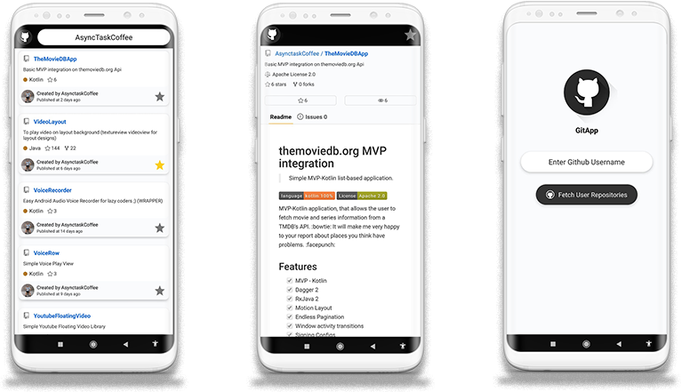
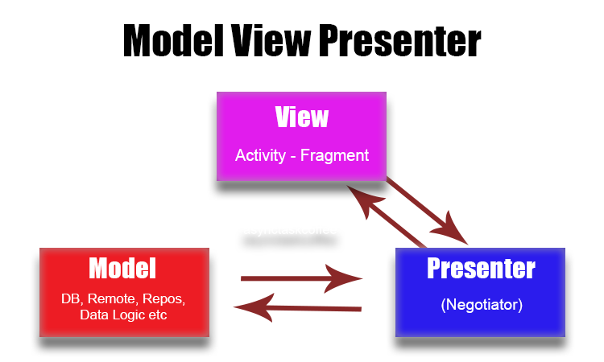

# GitHub Personal Application - GitAPP (MVP integration)
> Simple MVP-Kotlin-Realm list-based application.

[](https://kotlinlang.org/)
[](https://opensource.org/licenses/Apache-2.0)

MVP-Kotlin application, that allows the user to monitor repository details and add and remove repos to favorites (Realm)



## Features

- [x] MVP - Kotlin
- [x] Dagger 2
- [x] RxJava 2
- [x] Motion Layout

## MVP Kotlin

The main purpose of MVP (Model - View - Presenter) is to separate the user interface from the business logic.

### MVP General Structure




## License

```
Copyright 2020 Egemen ÖZOGUL

Licensed under the Apache License, Version 2.0 (the "License");
you may not use this file except in compliance with the License.
You may obtain a copy of the License at

    http://www.apache.org/licenses/LICENSE-2.0

Unless required by applicable law or agreed to in writing, software
distributed under the License is distributed on an "AS IS" BASIS,
WITHOUT WARRANTIES OR CONDITIONS OF ANY KIND, either express or implied.
See the License for the specific language governing permissions and
limitations under the License.
```

